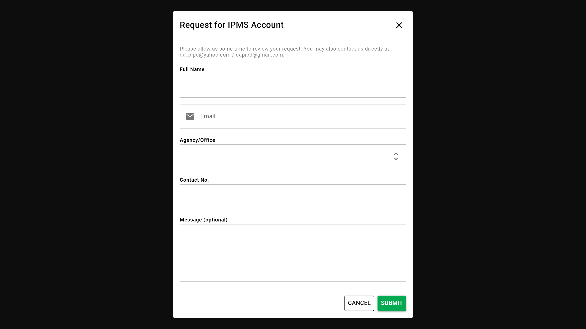

## Creating an Account

Only authorized users can access content of the IPMS; thus, an account is needed to use it. To protect the system from unauthorized access, only administrators (i.e. IPD staff) are allowed to create user accounts. In addition, only users who are authorized by the head of agencies can be registered, i.e. registered PIP focal person of your operating unit. Once created, the IPD will provide the credentials (username and password) to the user via email. The username will be the email address you submitted during confirmation of focal persons.

Alternatively, you may also request for a new account from the Login page. Users can do this from the login page as shown below:

1. Click on <strong>Request one</strong>.

2. Provide the information needed (`full name`, `email`, `agency/office`, `contact no.` and `custom message`). In the custom message, please provide the reason for the request.

3. Once done, click <strong>Submit</strong>.

<InlineNotification kind="warning">
An admin will review the request. Please note that the IPD reserves the right to approve/disapprove your request. You may also coordinate directly with the IPD especially if your request is urgent.
</InlineNotification>