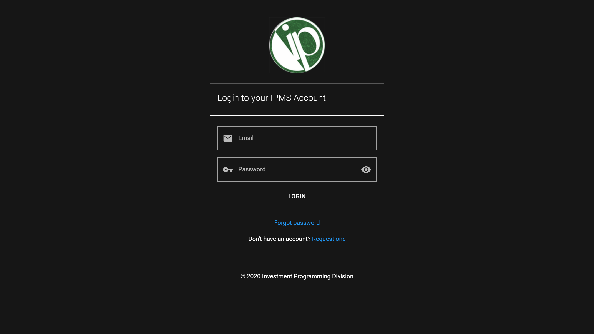

## Logging in to the IPMS

### First Time

1. Click on `Login` button in the `Welcome Screen`. Alternatively, you may type the address for login through `https://da-ipms2020.web.app/login`.

<ImageCard title="Logging in to your account" href="/">
  
</ImageCard>

2. In the form, input your `email` and `password`.

3. Click on the `login` button.

4. After logging in for the first time, you need to change your password as the IPD is still aware of your password. For more information, go to [changing your password](#changing-your-password).

5. Verify your email to ensure that you can receive updates from the system and access other security features. For more information, go to [verifying your email address](#verifying-your-email-address).

6. Upon successful login, you will see the following screen:

### Succeeding

Follow the above steps from 1 to 3.

As with other application, while not required, make sure you verify your [email](#verify-email). Instructions are shown below.